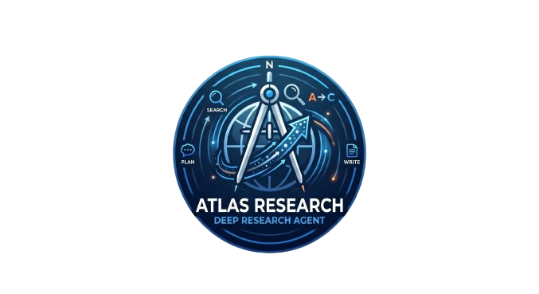

<div align="center">

<!-- LOGO -->


<h1>Atlas Research</h1>

<p>
  <strong>A lightweight, production-ready Deep Research Agent web application.</strong><br/>
  Empowers users to run autonomous deep investigations using Tavily Search and LangGraph-powered AI agents in the background.
</p>

<!-- BADGES -->


</div>

---

## What is this?

**Atlas Research** is a deep research agent web application designed to handle complex, multi-step queries autonomously. Instead of performing a single web search and returning a generic answer, it spins up an agentic research loop that plans its investigation, queries the web multiple times using Tavily, reads/synthesizes the raw pages, and formats the gathered intelligence into a cited, long-form report.

You can watch the entire process unfold live on a terminal-style agent log feed (from planning to searching, synthesizing, writing, and completion).

---

## Asynchronous Agent Architecture (Our Approach)

Running multi-step LLM loops with sequential API calls takes time (usually between 30 seconds and 3 minutes). Directly waiting for this in an API handler causes request timeouts and frozen user interfaces.

**Our Asynchronous Solution:**
1. **Background Spawning:** The client POSTs a query to `/api/research`. The server creates a session record in Supabase with a `'running'` status and immediately returns the `sessionId` to the frontend.
2. **Non-Blocking Execution:** The server route launches `runAgent()` asynchronously in the background. As the agent traverses its LangGraph execution flow, it logs its status and steps to the Supabase database in real time.
3. **Frontend Polling Feed:** The frontend client polls the dynamic session route (`/api/research/[id]`) every 2 seconds. This fetches the progress logs and displays them like a live terminal feed. Once status changes to `'completed'`, the full Markdown report renders on the screen.

---

## Why LangGraph & Deep Agents are Critical

Autonomous deep research requires statefulness, task planning, and error recovery loops. We utilize **LangGraph** (via the `deepagents` harness) to handle these complex agent requirements:

1. **Statefulness:** The agent maintains a persistent virtual filesystem and message thread directly inside the graph state.
2. **Cyclical Execution:** The LLM can decide whether to run another web search, parse a file, refine its research plan, or write the final report, looping back as many times as necessary.
3. **Structured Tool Interception:** The harness routes tool executions through dedicated nodes, separating the LLM request layer from tool responses for robust logging.

---

## Features & Log Step Coverage

The agent reports its active operations through the database to supply the live terminal UI feed:

| Step Type | UI Label | Indicator / Description |
| --- | --- | --- |
| **planning** | `[ PLAN ]` | Breaks down the research question and schedules a list of tasks. |
| **searching** | `[ SEARCH ]` | Queries Tavily Search with targeted keywords to extract source pages. |
| **synthesizing** | `[ SYNTH ]` | Reads, validates, and analyzes the contents of the search results. |
| **writing** | `[ WRITE ]` | Assembles the final structured Markdown report (with Summary, Findings, details, and cited Sources). |
| **done** | `[ DONE ]` | Finalizes the session and saves the completed report. |

---

## Cost Efficiency (Default Config)

The project is optimized for high performance, ultra-low latency, and minimal cost:

| Component | Provider / Model | Approximate Cost |
| --- | --- | --- |
| **LLM Core Engine** | `google/gemini-2.5-flash-lite` | ~$0.10 / 1M input · $0.40 / 1M output |
| **Web Search** | `Tavily Search API` | Free (Developer Tier) |
| **Backend Storage & Logs** | `Supabase Database` | Free (Standard Tier) |

---

## Getting Started

### Prerequisites

- **Node.js** (v18 or higher)
- **Supabase** account/database set up with `research_sessions` and `research_steps` tables

### 1. Clone the repository

```bash
git clone https://github.com/Professional/DEEPAGENT/atlas-research.git
cd atlas-research
```

### 2. Configure Environment

Create a `.env.local` file at the root of the project and set your credentials:

```env
# OpenRouter API Key
OPENROUTER_API_KEY=your_openrouter_api_key_here

# Tavily Search API Key
TAVILY_API_KEY=your_tavily_api_key_here

# Supabase Configurations
NEXT_PUBLIC_SUPABASE_URL=https://your-project.supabase.co
NEXT_PUBLIC_SUPABASE_ANON_KEY=your_anon_key_here
SUPABASE_SERVICE_ROLE_KEY=your_service_role_key_here
```

### 3. Install Dependencies

```bash
npm install
```

### 4. Run the Development Server

```bash
npm run dev
```

Open [http://localhost:3000](http://localhost:3000) in your browser to start using the research agent.

---

## Project Structure

```
atlas-research/
├── public/
│   └── logo.png             # Project logo asset
├── src/
│   ├── app/
│   │   ├── api/
│   │   │   ├── research/
│   │   │   │   ├── [id]/
│   │   │   │   │   └── route.ts  # Session polling GET endpoint
│   │   │   │   └── route.ts      # Agent initiator POST endpoint
│   │   │   └── page.tsx          # Main terminal user interface
│   │   │   └── layout.tsx        # Next.js App Router root layout
│   │   │   └── globals.css       # Global styling configurations
│   ├── lib/
│   │   ├── agent/
│   │   │   └── research.ts       # LLM, Tavily tool, and system prompt setup
│   │   └── supabase/
│   │       ├── client.ts         # Supabase client-safe connector
│   │       └── server.ts         # Supabase service-role server connector
├── ABOUT.md                      # Detailed project documentation and guides
├── AGENTS.md                     # Target documentation instruction maps
├── tsconfig.json                 # TypeScript compiler setup
├── next.config.ts                # Next.js framework configuration
└── package.json                  # Dependencies list and scripts
```

---

## License

MIT — feel free to modify and share!

---

<div align="center">
  <sub>Built for autonomous deep research. Explore knowledge efficiently.</sub>
</div>
